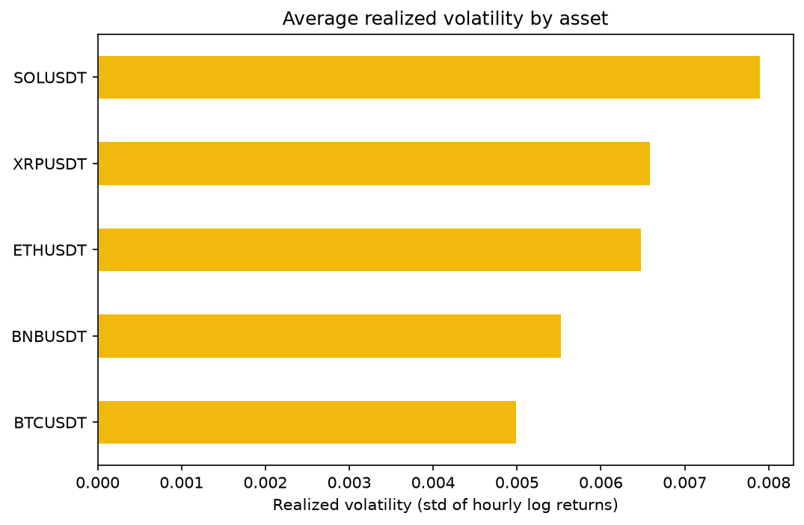
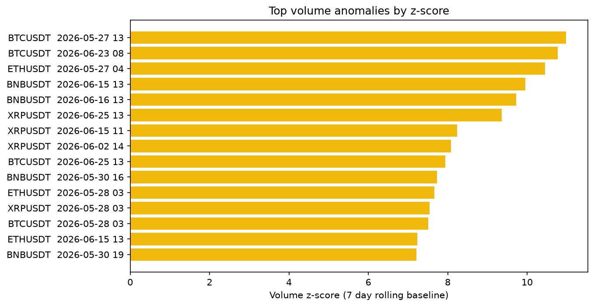
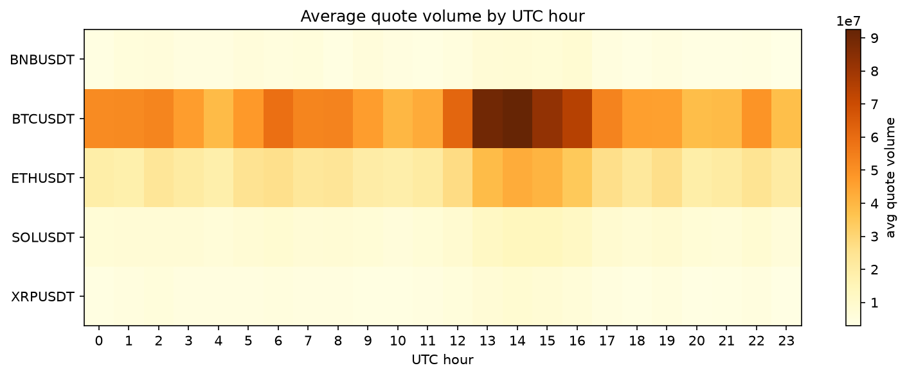
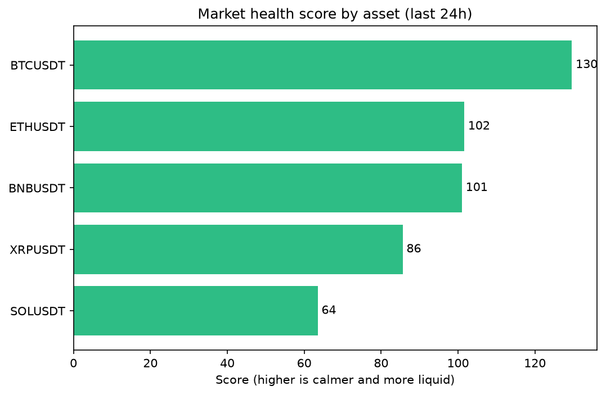

# Crypto Market Intelligence

A lightweight market intelligence project built with public Binance market data.

The goal is to detect abnormal market activity across major crypto pairs using SQL, Python and visual analytics. The project focuses on volatility, volume anomalies, trading session behaviour and a simple market health scoring framework.

## Why this project matters

Crypto markets run 24/7, which makes anomaly detection, liquidity monitoring and fast reporting especially important. This project simulates the type of analysis that supports Risk, Market Operations, Growth and Business Intelligence teams inside a crypto exchange.

The question it answers is simple:

> Which assets show unusual activity, volatility expansion or liquidity stress compared with their recent baseline?

## Results

These charts are generated from live public Binance data by a GitHub Action and refreshed automatically, so the figures below reflect a real recent window rather than mock data.

| Realized volatility by asset | Volume anomalies |
| --- | --- |
|  |  |

| Volume by trading session | Market health score |
| --- | --- |
|  |  |

A short written read of each run lives in [outputs/summary_report.md](outputs/summary_report.md).

## What it does

- Pulls public 1 hour candlestick (kline) data for five major pairs.
- Loads everything into a local DuckDB database.
- Runs analytical SQL to build KPIs, volatility measures and a rolling volume baseline.
- Flags abnormal volume using a 7 day rolling z-score.
- Breaks activity down by trading session (Asia, Europe, US).
- Produces a simple market health score per asset.
- Writes a short summary report aimed at a non technical reader.

## Assets and timeframe

| Pair | Why it is here |
| --- | --- |
| BTCUSDT | Blue chip reference |
| ETHUSDT | Blue chip reference |
| BNBUSDT | Binance ecosystem |
| SOLUSDT | High beta asset |
| XRPUSDT | Retail heavy asset |

Timeframe: 1 hour candles over a recent window. Enough to surface hourly patterns, volatility regimes, volume outliers and session behaviour without building a monster.

## Skills demonstrated

- SQL data modelling and analytical queries (window functions, rolling baselines, ratios).
- Python data cleaning and feature engineering.
- Time series analysis and realized volatility.
- Market microstructure intuition (liquidity, taker flow, sessions).
- Statistical anomaly detection.
- Data visualization and clear business reporting.
- Reproducible project structure with CI that runs the analysis end to end.

## Data source

This project uses public Binance market data, including kline / candlestick data and aggregate trade data. No private account data, API keys or trading activity are used. Public market data endpoints are reached through the market data only domain, so no authentication is required.

## Project structure

```text
crypto-market-intelligence/
.
README.md
requirements.txt
.gitignore

data/
  raw/                 sample only, full data is git ignored
  processed/

sql/
  01_create_tables.sql
  02_market_kpis.sql
  03_volume_anomalies.sql
  04_volatility_regimes.sql
  05_session_analysis.sql
  06_market_health_score.sql

src/
  download_binance_data.py
  load_to_duckdb.py
  generate_charts.py
  utils.py

notebooks/
  01_market_intelligence_analysis.ipynb

outputs/
  charts/
    volatility_by_asset.png
    volume_anomaly_score.png
    session_volume_heatmap.png
    market_health_score.png
  summary_report.md

.github/workflows/
  build-charts.yml
```

## How the charts stay fresh

A GitHub Action (`.github/workflows/build-charts.yml`) runs `src/generate_charts.py`, which downloads live Binance data, runs the SQL and regenerates the four PNG charts. It runs on demand and on a weekly schedule, then commits the updated charts back to the repo.

## How to run it yourself

```bash
# 1. Install dependencies
pip install -r requirements.txt

# 2. Build the charts from live Binance data in one step
python src/generate_charts.py

# Or run the full pipeline by hand and explore it in the notebook:
python src/download_binance_data.py
python src/load_to_duckdb.py
jupyter notebook notebooks/01_market_intelligence_analysis.ipynb
```

## Market health score

A simple, explainable score per asset. It is not meant to be perfect, it is meant to be transparent:

```text
market_health_score =
    100
    - volatility_penalty
    + liquidity_reward
    + trade_activity_reward
```

The reasoning behind each component is documented in the SQL and in the notebook.

## Scope and limitations

- This is market intelligence, not trading advice.
- The sample is a recent historical window, so results describe that period only.
- The health score is a heuristic, useful for monitoring and triage rather than prediction.

## Author

Built by Oliver Arjonilla as part of a data analytics portfolio focused on crypto markets, risk and operations.
